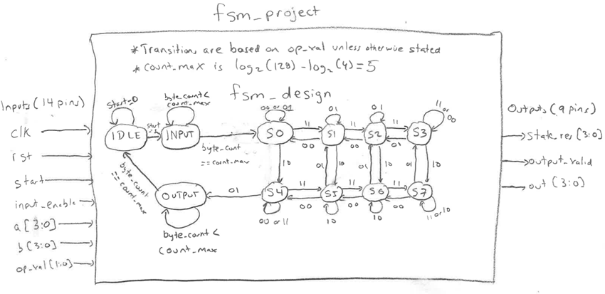

<!---

This file is used to generate your project datasheet. Please fill in the information below and delete any unused
sections. 

You can also include images in this folder and reference them in the markdown. Each image must be less than
512 kb in size, and the combined size of all images must be less than 1 MB. 
-->

## How it works
 
This is an example final project SystemVerilog example for the CSE 30342 Digital Integrated Circuits course at the University of Notre Dame 
 
The objective of this project is to develop a robust finite-state machine that instructs students on how to implement a design in their final course project. Since the project requirement is that the Finite State Machine has at least five states (not including the IDLE, INPUT, and OUTPUT states) where at least two of those five have a self-feedback loop, and two of those five have an edge that goes backwards, this design goes to an extreme where every state has a self-feedback loop and every state has at least one edge that goes backwards. I will explain how this FSM meets the requirement in this report. 

The require project diagram is listed below. In the student project, there will be a purpose behind the FSM, such as a vending machine or stop light or something the students have developed themselves. In this section, describe the purpose and operation of your design. 

This purpose of this project is a “memory calculator”, where the output of the states are driven by the initial 128-bit inputs a and b, as well as the previous result. Each state has a unique calculation that are designed to help students understand certain SystemVerilog coding techniques, such as concatenation, as well as an example of how to implement modulo using loops, which is one of the forbidden operators in Genus Synthesis Solution. List each input and output, and state the count for ease of grading.
The project has 23 total pins, meeting the project requirement. To meet the input and output requirements of the project, the pins are implemented as follows: 
•	One clk pin 
•	One rst pin 
•	One start pin 
•	One input_enable pin 
•	A four-bit input for a 
•	A four-bit input for b 
•	A two-bit op_val, since each state can have up to 4 possible transitions  
•	A four-bit out signal representing the output 
•	A one-bit output_valid signal 
•	A four-bit signal representing the current state, since there are 11 possible states. 
 
In the INPUT state, the inputs for a and b are read in parallel, and are controlled using an input_enable signal. Parameter N is set to 128 by default, and N_width is set to 4. The INPUT state requires the input_enable signal to be positive to overwrite the previous result. This choice meets the requirement that there be at least one input that is 32-bits in length. The OUTPUT state pipelines the output on the out pin, and is controlled by sending an output_valid signal. 
 
 
 
In this design, we define the “internal states” as every state with the exception of IDLE, INPUT, and OUTPUT. Every internal state has a feedback loop and a return edge, with the exception of S0, which does not have a return edge, meeting the project requirements that at least two internal states have a feedback loop, and that two internal states have a return edge. For example, S1’s feedback loop occurs when op_val is 01, and its feedback loop occurs when op_val is 00, and its return edges are 00 (back to S0) and 01 (back to S5). In your report, list them explicitly to make the grading easier. For example: 
To meet the project design requirements, the FSM is designed as follows 
•	There are eight internal states: S0, S1, S2, S3, S4, S5, S6, and S7 
o	S0 produces simple bitwise logic 
o	S1 produces a+b, and then xor with the previous result 
o	S2 produces the absolute difference of a and b, then XOR with prev_result 
o	S3 produces the min(a,b) which blended with prev_result using concatenation 
o	S4 produces max(a,b) plus a small shift of prev_result 
o	S5 produces saturation of add of a and b, then AND with prev_result 
o	S6 produces the average of a and b, then OR with prev_result 
o	S7 produces simple rotate-left of a by 1, then XOR with b and the previous result 
•	Feedback loops: S0 when op_val is 00 or 01, S1 when op_val is 01, S2 when op_val is 01, and so on… 
•	Return edges: S1 when op_val is 00 or 01, S2 when op_val is 00 or 01, S3 when op_val is 00, and so on… 
   
The unique case is state S4, which has a transition to the OUTPUT state when op_val is 01. The OUTPUT state, upon completion, goes back to the IDLE state to wait for the next start signal. 
 

## How to test

The fsm_example_tb.sv file is included

## External hardware

None required other than the TinyTapeout LED.
